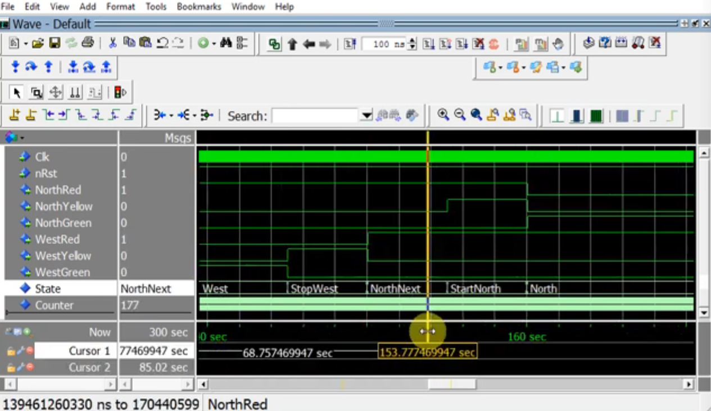

# Traffic Lights VHDL Using Procedure

## Overview

This repository contains a VHDL testbench and application for a Traffic Lights controller. The testbench simulates the behavior of the Traffic Lights system by generating clock signals and controlling reset signals. 

## Features

- **Simulation Environment**: A simple environment for testing the Traffic Lights controller.
- **Clock Generation**: Generates a clock signal with a configurable frequency.
- **Reset Control**: Simulates taking the system out of reset.

## Code Structure

The main components of the testbench are:

- **Entity Declaration**: Defines the `TrafficLightsTb` entity without any ports.
- **Architecture**: The architecture named `sim` defines the simulation environment.
- **Constants and Signals**: Includes configuration for clock frequency and signals for traffic light states.
- **Device Under Test (DUT)**: Instantiates the Traffic Lights controller.
- **Clock Generation**: Generates a clock signal.
- **Testbench Sequence**: Controls the simulation process.

## Waveform

